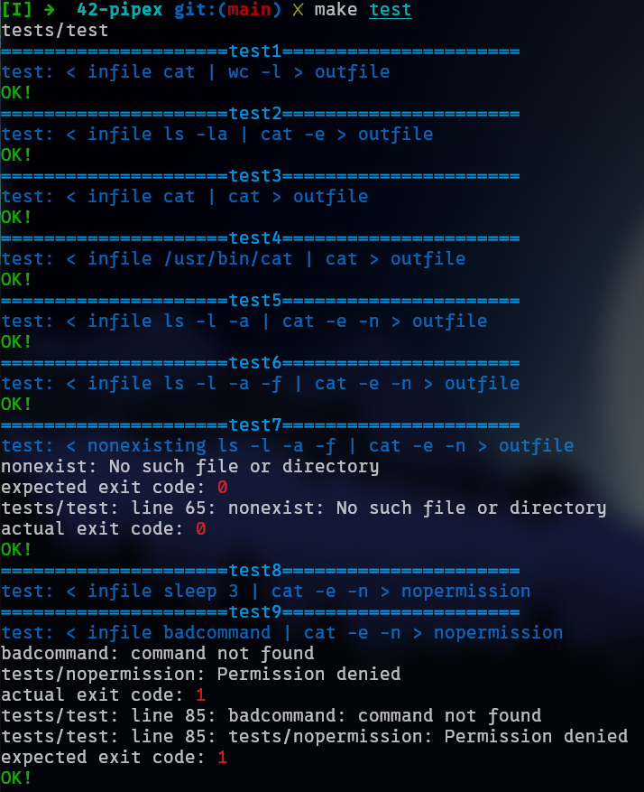

# Minipipe
Building a pipeline in C

This project, "Minipipe," is a fundamental dive into Unix inter-process communication (IPC) using pipes. It replicates the core functionality of shell pipelines (`< infile cmd1 | cmd2 > outfile`), allowing me to execute two commands with their input/output redirected and connected via a pipe.

This is definitely my favorite project so far because I get to learn in a deeper level how processes work and how data flow through processes using pipes. Through this project, I've gained a solid understanding of low-level system calls essential for process management and IPC.

## 📚 Concepts Learned & Reinforced

### Process Management
* **`fork()`**: Understanding how `fork()` creates a new, duplicate child process, including the intricacies of the **Copy-on-Write (CoW)** mechanism for memory pages. This taught me why direct memory sharing isn't possible with `fork()` alone and how changes in one process's memory won't affect the other without explicit IPC.
* **`execve()`**: Deep dive into how `execve()` replaces the current process image with a new program. I learned about its `filename`, `argv`, and `envp` parameters, and the critical importance of providing a valid path (`filename`) and a correctly formatted, null-terminated argument list (`argv`).
* **`waitpid()`**: Grasping how the parent process waits for its child processes to complete, preventing zombie processes and ensuring proper execution flow.
* **Process IDs (`pid_t`)**: Working with PIDs to identify and manage individual processes.
* **Child Process Exit Status (e.g., `127` for command not found)**: Understanding conventional exit codes for processes.

### File Descriptors & I/O Redirection
* **File Descriptors (FDs)**: Solidifying my understanding of FDs as integer identifiers for open files, devices, pipes, etc.
* **`open()`**: Opening files for reading, writing, and creating them with specific permissions (`O_RDONLY`, `O_WRONLY`, `O_CREAT`, `O_TRUNC`, and permission modes like `0644`). Crucially, learning when and where to perform `open()` calls (e.g., handling `outfile` permissions in the parent before forking, but opening the actual `fd` in the child).
* **`close()`**: The importance of explicitly closing file descriptors to prevent resource leaks and to signal End-Of-File (EOF) on pipes to reading processes.
* **`dup2()`**: Mastering I/O redirection by duplicating file descriptors. This is fundamental for connecting `stdin`/`stdout` of commands to files or pipes. For example, `dup2(pipe_read_end, STDIN_FILENO)` for a command reading from a pipe.
* **Standard File Descriptors (`STDIN_FILENO`, `STDOUT_FILENO`, `STDERR_FILENO`)**: Using these symbolic constants for clear and correct redirection of standard input, output, and error.

### Inter-Process Communication (IPC) with Pipes
* **`pipe()`**: Creating an anonymous pipe (a unidirectional communication channel) consisting of two file descriptors: a read end and a write end.
* **Pipeline Logic**: Understanding the core mechanism of how `cmd1`'s standard output is redirected to the write end of a pipe, and `cmd2`'s standard input is redirected from the read end of the same pipe.
* **Pipe Management in Parent and Children**: The critical rule of closing unused pipe ends in both parent and child processes to avoid deadlocks and ensure correct EOF signaling. For instance, the writing child closes the read end of the pipe, the reading child closes the write end, and the parent closes both its copies of the pipe ends after forking children.

### Error Handling & Debugging
* **`errno`**: Understanding the global variable `errno` for retrieving specific error codes after system call failures. Crucially, learning that `errno` is only set on error, not cleared on success, and must be checked immediately after a failing call.
* **`perror()` vs. `strerror()`**: Differentiating between `perror()` (which prints a custom message and the `errno` string to `stderr`) and `strerror()` (which returns a string corresponding to an `errno` value). This helped in providing informative error messages.
* **Valgrind (`--track-fds=yes`)**: Utilizing Valgrind to detect memory leaks and, specifically, file descriptor leaks, which is invaluable for ensuring resource cleanup in complex multi-process programs.
* **Debugging `execve` failures**: Learning that `fprintf(stderr, "%s", NULL)` leads to segmentation faults, and that `bin` must be checked for `NULL` before passing to `execve`.

### Automated testing using Bash
* Run `make test` to begin testing

## 🛠️ Functions Used

Here's a list of the primary system calls and standard library functions that are central to this project:

* [`fork()`](https://man7.org/linux/man-pages/man2/fork.2.html): Creates a new process.
* [`pipe()`](https://man7.org/linux/man-pages/man2/pipe.2.html): Creates an anonymous pipe.
* [`dup2()`](https://man7.org/linux/man-pages/man2/dup.2.html): Duplicates an old file descriptor onto a new one.
* [`execve()`](https://man7.org/linux/man-pages/man2/execve.2.html): Executes a new program.
* [`open()`](https://man7.org/linux/man-pages/man2/open.2.html): Opens a file.
* [`close()`](https://man7.org/linux/man-pages/man2/close.2.html): Closes a file descriptor.
* [`waitpid()`](https://man7.org/linux/man-pages/man2/wait.2.html): Waits for a child process to change state.
* [`access()`](https://man7.org/linux/man-pages/man2/access.2.html): Checks user's permissions for a file.
* [`perror()`](https://man7.org/linux/man-pages/man3/perror.3.html): Prints a system error message.
* [`strerror()`](https://man7.org/linux/man-pages/man3/strerror.3.html): Returns a string describing an error code.
* [`malloc()`](https://man7.org/linux/man-pages/man3/malloc.3.html) / [`free()`](https://man7.org/linux/man-pages/man3/free.3.html): Dynamic memory allocation and deallocation.
* [`exit()`](https://man7.org/linux/man-pages/man3/exit.3.html): Terminates the calling process.

## 📈 Further Improvement
* Implement multiple pipes `< infile cmd1 | cmd2 | cmd3 > outfile`
* Implement heredocs and herestrings

**This project has been a challenging yet rewarding experience, providing a robust foundation in Unix system programming and IPC.**
